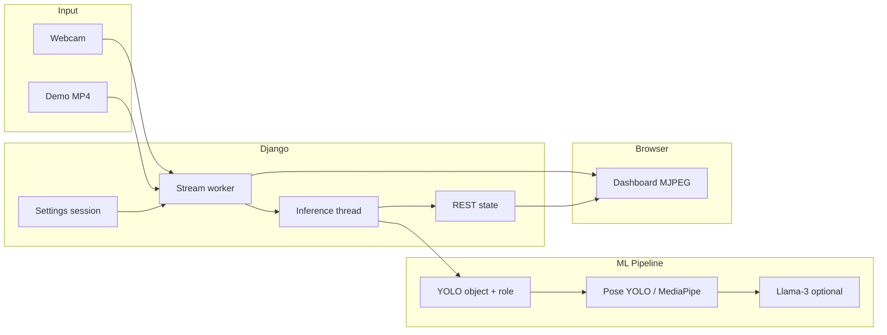

# MedPerceptAI

Hospital-style **live patient monitoring** with a Django web dashboard, MJPEG video stream, multi-model computer vision (YOLO + pose), and optional **Llama-3** reasoning for clinical-style intent alerts. Staff log in with role-based access; nurses and doctors only see alerts for their assigned **building and floor**.

---

## Features

| Area | Description |
|------|-------------|
| **Live stream** | MJPEG feed at `/stream/` with CCTV overlay (building, floor, room, timestamp) |
| **Video sources** | Webcam (`camera`) or pre-recorded file (`video`, e.g. `media/demo.mp4`) |
| **AI pipeline** | Object detection (`obj.pt`), role/patient detection (`roles.pt`), pose (`yolov8n-pose.pt` or MediaPipe) |
| **Reasoning** | Optional Llama-3 GGUF; toggle in **Settings** (OFF = fast stream, ON = deeper analysis, slow on CPU) |
| **RBAC** | Roles: **Nurse**, **Doctor**, **Admin** — location-filtered alerts and event logs |
| **Admin settings** | Monitoring source, building/floor/room, Llama toggle, create staff accounts |
| **Pages** | Dashboard, Live Monitor, Alerts, Patient History, Settings |

---

## Architecture (high level)



- **Capture thread** reads frames at camera/video FPS and pushes JPEG chunks to the MJPEG response.
- **Inference thread** runs YOLO/pose (and Llama when enabled) without blocking video playback.
- **Event log** is in-memory (resets on server restart); dashboard polls `/api/latest-alert/` for live intent text.

---

## Project structure

```
MedPerceptAI/
├── README.md
├── requirements.txt          # llama-cpp-python (see install below for full stack)
├── hardware                  # Example CPU vs GPU .env snippets
├── medPerceptai/
│   ├── manage.py
│   ├── .env                  # Local config (not committed — create from examples)
│   ├── db.sqlite3            # Created after migrate (not committed)
│   ├── media/                # demo.mp4, uploads (not committed)
│   ├── model_weights/        # YOLO + Llama weights (not committed)
│   ├── accounts/             # Users, StaffProfile, RBAC, Settings views
│   ├── monitor/              # Stream, ML pipeline, alerts API
│   ├── templates/            # dashboard, live_monitor, alerts, settings, …
│   └── medPerceptai/         # Django settings & URLs
└── env/                      # Virtual environment (local)
```

---

## Requirements

### Software

- **Python 3.10+** (3.11–3.13 tested on Windows)
- **Windows 10/11** (primary dev target; camera uses DSHOW → MSMF backends)
- Optional: **NVIDIA GPU + CUDA** for faster YOLO and Llama (`LLAMA_N_GPU_LAYERS=-1`)

### Model files (place under `medPerceptai/model_weights/`)

| File | Purpose |
|------|---------|
| `obj.pt` | Patient/object detection |
| `roles.pt` | Staff vs patient role classification |
| `yolov8n-pose.pt` | Pose estimation (recommended; set `POSE_BACKEND=yolo`) |
| `pose_landmarker_lite.task` | MediaPipe pose fallback |
| `llama-3-8b-instruct.Q4_K_M.gguf` | Optional Llama-3 reasoning |

### Demo video

Place a test clip at:

`medPerceptai/media/demo.mp4`

(or set `MONITOR_VIDEO_PATH` in `.env` / Settings).

---

## Installation

### 1. Clone and virtual environment

```powershell
cd "C:\Users\THINK PAD\Desktop\MedPerceptAI"
python -m venv env
.\env\Scripts\Activate.ps1
```

### 2. Python dependencies

`requirements.txt` lists `llama-cpp-python`. Install the full stack:

```powershell
pip install django python-dotenv opencv-python numpy torch ultralytics mediapipe
pip install llama-cpp-python
```

For **GPU Llama** on an RTX laptop (presentation machine):

```powershell
$env:CMAKE_ARGS="-DLLAMA_CUBLAS=on"
pip install --no-cache-dir --force-reinstall llama-cpp-python
```

### 3. Environment file

Create `medPerceptai/.env` (never commit secrets or machine-specific paths to git):

```env
# Stream (defaults; Admin can override in Settings UI)
MONITOR_INPUT_SOURCE=video
MONITOR_CAMERA_INDEX=0
MONITOR_VIDEO_PATH=media/demo.mp4

# YOLO / pose (use paths relative to medPerceptai/ or absolute)
YOLO_OBJECT_MODEL_PATH=model_weights/obj.pt
YOLO_ROLE_MODEL_PATH=model_weights/roles.pt
YOLO_POSE_MODEL_PATH=model_weights/yolov8n-pose.pt
POSE_BACKEND=yolo

# Llama (keep OFF on CPU laptops for smooth video)
REASONING_MODEL_PATH=model_weights/llama-3-8b-instruct.Q4_K_M.gguf
ENABLE_REASONING=0
LLAMA_N_GPU_LAYERS=0
LLAMA_N_CTX=2048
LLAMA_N_BATCH=512
LLAMA_N_THREADS=4

# Optional tuning
INFERENCE_EVERY_N_FRAMES=2
YOLO_CONFIDENCE=0.25
```

See `hardware` in the repo root for **CPU vs GPU** example blocks.

### 4. Database and admin user

```powershell
cd medPerceptai
python manage.py migrate
python manage.py createsuperuser
python manage.py runserver
```

Open **http://127.0.0.1:8000/** → login → **Settings** (Admin).

---

## First-time setup (Admin)

1. Log in as **superuser** or a user with **Admin** role.
2. **Settings → Step 1** — Choose **Demo video file** or **Webcam**, set **Building** (e.g. `Main Building`) and **Floor** (e.g. `3`), click **Save monitoring**.
3. **Step 2** — Leave **Llama-3 OFF** on a laptop without GPU; turn **ON** only for deep-dive demos (expect lower FPS on CPU).
4. **Step 3** — Create staff: username, password, role (Nurse/Doctor), same **building + floor** as monitoring.
5. Open **Dashboard** — hard refresh (**Ctrl+F5**) so the stream URL picks up `stream_cache_key`.

Staff log in at `/login/` and see alerts only for their unit (unless Admin).

---

## Roles and access

| Role | Settings | Alerts / logs |
|------|----------|----------------|
| **Admin** | Full monitoring + staff creation | All locations (superuser = all units) |
| **Nurse** | Profile only | Same building **and** floor as `StaffProfile` |
| **Doctor** | Profile only | Same as nurse |

Assign profiles in **Settings** (create staff) or **Django Admin** (`/admin/`) under Users + Staff profiles.

**Important:** Monitoring **Building** and **Floor** in Settings must match staff accounts, or nurses will not see live alerts for that stream.

---

## URLs

| Path | Description |
|------|-------------|
| `/` | Home |
| `/login/` | Staff login |
| `/dashboard/` | Main live dashboard + MJPEG embed |
| `/live-monitor/` | Camera-focused view |
| `/alerts/` | Alert list (location-filtered) |
| `/patient-history/` | Event history |
| `/settings/` | Admin monitoring + staff (Admin only for edits) |
| `/stream/` | MJPEG live feed (login required) |
| `/api/latest-alert/` | JSON inference state (polled by UI) |
| `/admin/` | Django admin |

---

## Environment variables reference

| Variable | Default | Description |
|----------|---------|-------------|
| `MONITOR_INPUT_SOURCE` | `camera` | `camera` or `video` |
| `MONITOR_CAMERA_INDEX` | `0` | Webcam device index |
| `MONITOR_VIDEO_PATH` | `media/demo.mp4` | Path to MP4 when source is `video` |
| `YOLO_OBJECT_MODEL_PATH` | `model_weights/obj.pt` | Object detector |
| `YOLO_ROLE_MODEL_PATH` | `model_weights/roles.pt` | Role classifier |
| `YOLO_POSE_MODEL_PATH` | `model_weights/yolov8n-pose.pt` | Pose model |
| `POSE_BACKEND` | `yolo` if file exists | `yolo`, `mediapipe`, or `auto` |
| `ENABLE_REASONING` | `1` in code env | `0` = skip Llama globally unless Settings toggle ON |
| `REASONING_MODEL_PATH` | Llama GGUF path | |
| `LLAMA_N_GPU_LAYERS` | `0` | `-1` = all layers on GPU (presentation) |
| `INFERENCE_EVERY_N_FRAMES` | `2` | Run full pipeline every N frames |
| `DJANGO_SECRET_KEY` | dev placeholder | Set in production |

Session keys (set from Settings UI): `monitor_source`, `monitor_building`, `monitor_floor_number`, `monitor_video_path`, `enable_ai_reasoning`, `stream_cache_key`.

---

## Demo profiles

### Laptop / CPU development (smooth video)

```env
MONITOR_INPUT_SOURCE=video
MONITOR_VIDEO_PATH=media/demo.mp4
ENABLE_REASONING=0
LLAMA_N_GPU_LAYERS=0
POSE_BACKEND=yolo
```

In the UI: **Settings → Llama-3 OFF**, save monitoring, restart server if the stream was already open.

### Presentation laptop (RTX + webcam)

```env
MONITOR_INPUT_SOURCE=camera
MONITOR_CAMERA_INDEX=0
ENABLE_REASONING=1
LLAMA_N_GPU_LAYERS=-1
```

Install CUDA-enabled `llama-cpp-python` (see Installation). Keep **Building/Floor** aligned with demo staff accounts.

---

## Troubleshooting

| Problem | What to try |
|---------|-------------|
| **Demo video frozen on first frame** | Restart server after code updates; ensure **Save monitoring** with `media/demo.mp4`; hard refresh dashboard. Capture and inference run on separate threads so video should advance while AI catches up. |
| **Black stream / FPS 0** | Confirm `/stream/` in terminal logs; check camera index; try demo video first; disable Llama. |
| **No alerts for nurse** | Match **Building** and **Floor** in Settings with the nurse’s `StaffProfile`. |
| **Very slow stream** | Turn **Llama-3 OFF**; use `ENABLE_REASONING=0`; reduce models or use GPU. |
| **Camera fails on Windows** | App tries DSHOW → MSMF → ANY; close other apps using the webcam. |
| **Settings 500** | Check template syntax; run `python manage.py check`. |
| **Models not found** | Verify files under `model_weights/` and paths in `.env`. |

---

## API (authenticated)

### `GET /stream/`

`multipart/x-mixed-replace` MJPEG. Requires login session (same as dashboard).

### `GET /api/latest-alert/`

JSON snapshot of latest inference (intent, alert flag, bbox, FPS, building, floor, etc.). Location filtering applied for non-admin users.

---

## Development notes

- **`.env`** and **`model_weights/`** are gitignored — copy layouts locally.
- **`media/`** is gitignored — add your own `demo.mp4`.
- Event log is **in-memory** (`monitor/views.py`); not persisted to DB yet.
- After changing monitoring settings, the UI bumps `stream_cache_key` to force the browser to reload the MJPEG `` URL.

---

## License

Add your license here if distributing the project.
